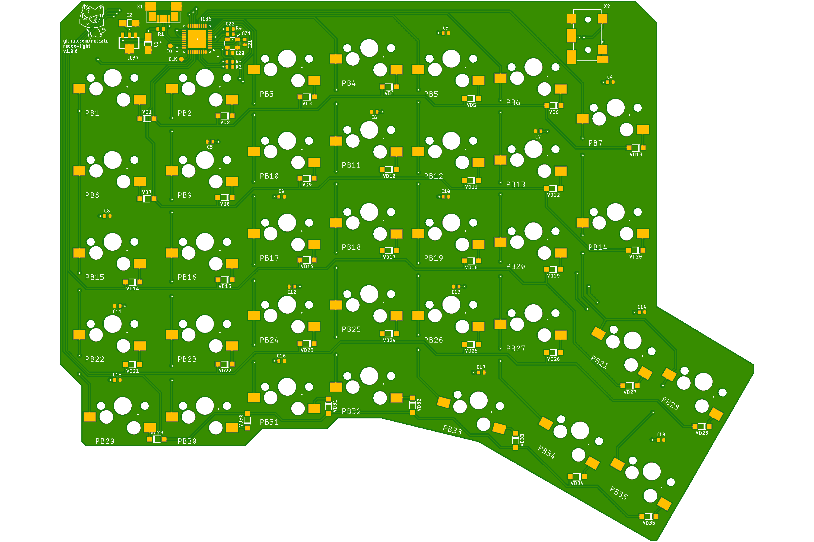
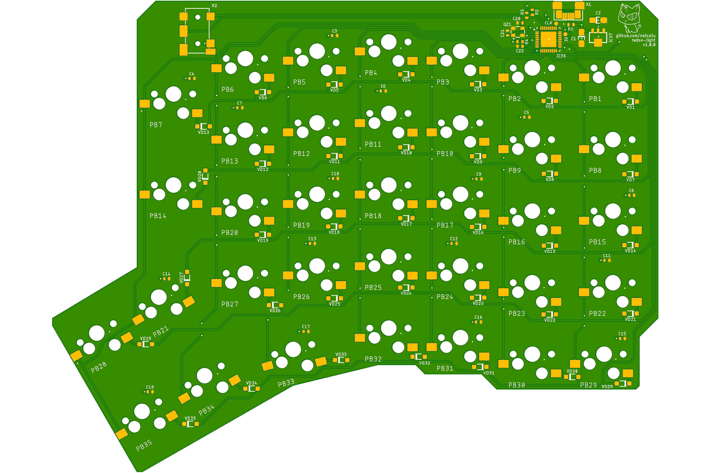

## About
Eagle version of PCB for [Redox keyboard](https://github.com/mattdibi/redox-keyboard) with RBG backlight (of each keys).

## PCB

## Hardware
* Cortex M3 STM32F103T8U
* SK6812 CMD 3535 Leds (similar with WS2812B)
* Cherry MX switches
* Kailh PCB sockets
